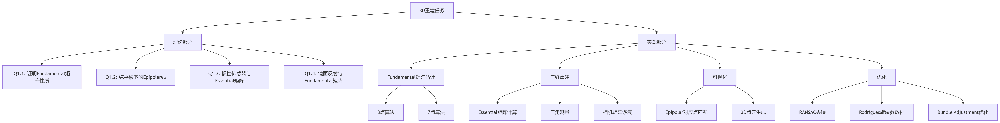

### 一周落地执行计划（每日任务分解）

#### **第1-2天：理论+基础实现**

1. **完成理论题**（Q1.1-Q1.4）
	- 推导数学公式，整理成报告附录
2. **实现8点算法**（`eightpoint()`函数）
	- 注意数据归一化与F矩阵的秩约束
3. **实现7点算法**（`sevenpoint()`函数）
	- 使用`np.roots()`解多项式，验证多个解

#### **第3-4天：三维重建核心**

1. **计算Essential矩阵**（`essentialMatrix()`）
	- 公式：�=�2���1*E*=*K*2*T**F**K*1
2. **三角测量**（`triangulate()`）
	- 构建��*A**i*矩阵，SVD求解3D点
3. **恢复相机矩阵**（`findM2.py`）
	- 测试4种解，选择正向深度的解

#### **第5天：可视化**

1. **Epipolar匹配**（`epipolarCorrespondence()`）
	- 沿极线滑动窗口搜索，用SSD匹配
2. **3D点云生成**（`visualize.py`）
	- 加载`templeCoords.npz`，用Matplotlib渲染

#### **第6天：高级优化**

1. **RANSAC去噪**（`ransacF()`）
	- 用7点算法+内点筛选（阈值设1e-3）
2. **Rodrigues旋转**（`rodrigues()`/`invRodrigues()`）
	- 实现罗德里格斯公式与逆变换
3. **Bundle Adjustment**（`bundleAdjustment()`）
	- 用`leastsq`优化重投影误差

#### **第7天：收尾与报告**

1. **英文报告撰写**（结构见下方模板）
2. **打包提交文件**
	- 代码：`.py`文件
	- 数据：`.npz`文件
	- 报告：PDF（含结果截图）

1. **Introduction**：简述 3D 重建的任务和本作业的目标。
2. **Theory**：详细解答 Q1.1-Q1.4，附数学推导和图表。
3. **Implementation**：分模块说明算法实现（八点 / 七点算法、三角化、RANSAC 等），附核心代码和结果分析。
4. **Results**：展示基础矩阵估计结果、3D 可视化截图、误差分析（重投影误差等）。
5. **Conclusion**：总结实验效果和改进方向。
6. **Appendix**：列出所有提交文件和代码清单。

